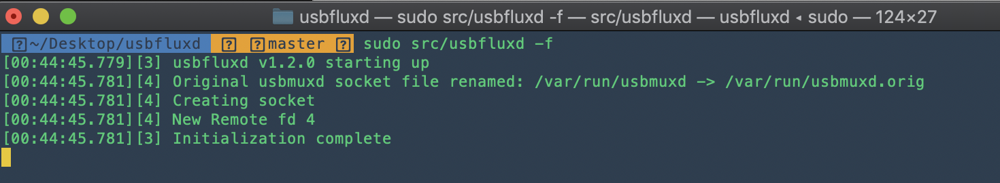
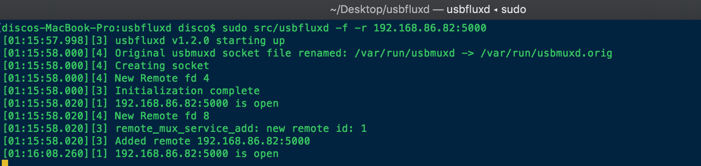
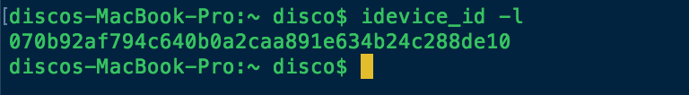

Using [usbfluxd](INSERT_LINK_HERE) to establish "local" connections to remote usbmuxd instances.

## Disclaimer
I am not affiliated with any of the projects that are discussed in this document. 

Usbfluxd is a product of [Corellium](https://www.corellium.com/). The source code used in this document was obtained from the [Corellium Github](https://github.com/corellium). Usbmuxd is a part of [libimobiledevice](https://github.com/libimobiledevice), an open source library for communicating with iOS devices.

All credit for these projects goes to their authors and maintainers.

## Requirements
1. Two macs located on the same LAN. It is possible to do this over internet but i'm not covering that (or the potential security risks).
2. At least 1 iOS device.
3. usbmuxd.
4. usbfluxd.
5. optionally libimobiledevice.

I will refer to the mac that is physically connected to the iOS device as `Server`. The mac that will be remotely connecting is `Client`.
Connect the iOS device to `Server`.

## Compile usbmuxd and usbfluxd
###### (Server and Client)
Each project's readme includes instructions on how to build.

[usbfluxd](https://github.com/corellium/usbfluxd).

[usbmuxd](https://github.com/libimobiledevice/usbmuxd).

[libimobiledevice](https://github.com/libimobiledevice/libimobiledevice) (optional).

###### (Server)

Launch `usbfluxd` with root privileges. `-f` prevents it from daemonizing if you want to see its output.

(From usbfluxd-master directory): `sudo src/usbfluxd`

This replaces usbmuxd’s socket file with usbfluxd’s. The next step is exposing the new socket over a tcp port so remote devices can see it.

## Installing socat
###### (Server)
[socat](https://linux.die.net/man/1/socat) (SOcket CAT) is a tool for transferring data between addresses. It will be used to expose the newly created usbfluxd socket to external devices.

The easiest way to acquire socat is via [Homebrew](https://brew.sh/).

    brew install socat
    
Once installed, expose the usbfluxd socket over port `5000`. `5000` can be substituted with anything else.

    socat tcp-listen:5000,fork unix-connect:/var/run/usbmuxd
    
socat's default behavior is to terminate after the first connection to it ends. `fork` tells socat to fork a child process to handle each incoming connection, allowing room for connection disruptions without completely killing the remote usbfluxd connection.

## Connecting to remote usbfluxd
###### (Client)
It is time to connect to the remote mac and establish connection to the iOS device.

You need the IP address of `Server`. If you substituted a different port than `5000` when launching socat, you will need to use that same port here.

    sudo src/usbfluxd -f -r 192.168.86.82:5000
    

That is all, the remote device should now appear connected to `Client`. If you have libimobiledevice, you can confirm using `idevice_id -l`.

